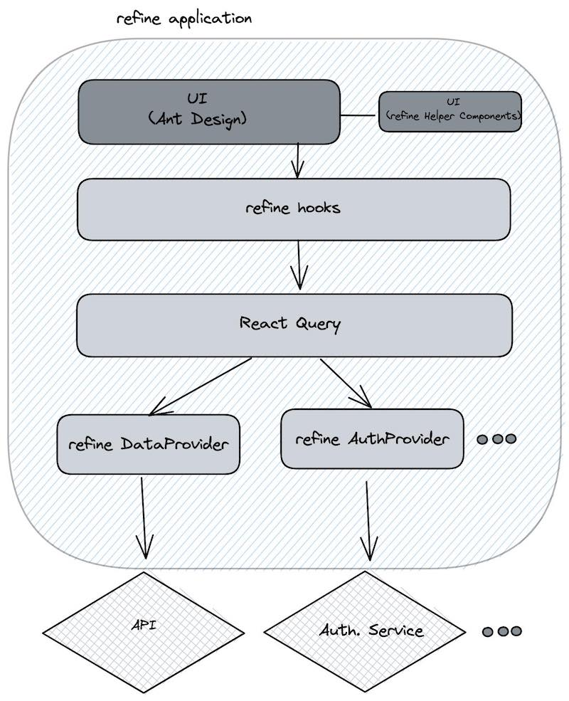
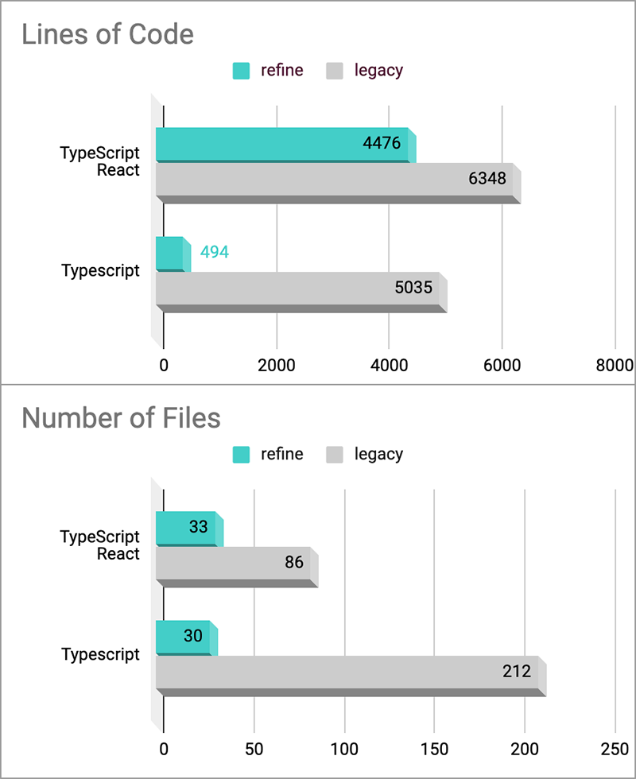

<div align="center" style="margin: 30px;">
<a href="https://refine.dev/">
  
</a>
<br />
<br />

</div>
<div align="center"><strong>refine</strong> is a <a href="https://reactjs.org/">React</a>-based framework for building data-intensive applications in no time ✨ It ships with <a href="https://ant.design/">Ant Design System</a>, an enterprise-level UI toolkit.</div>
<br/>

<div align="center">

[](https://twitter.com/intent/tweet?text=A%20React-based%20framework%20for%20building%20data-intensive%20applications%20in%20no%20time.&url=https://github.com/pankod/refine&hashtags=opensource,react,reactquery,antdesign)

[](https://meercode.io/)
[](https://meercode.io/)
[](https://codeclimate.com/github/pankod/refine/maintainability)
[](https://codeclimate.com/github/pankod/refine/test_coverage)
[](https://www.npmjs.com/package/@pankod/refine)
[](https://www.npmjs.com/package/@pankod/refine)
[](code_of_conduct.md)
[](https://discord.gg/UuU3XCc3J5)
</div>

<div align="center">
  <sub>Created by <a href="https://www.pankod.com">Pankod</a></sub>
</div>

## About

[**refine**](https://refine.dev/) offers lots of out-of-the box functionality for rapid development, without compromising extreme customizability. Use-cases include, but are not limited to *admin panels*, *B2B applications* and *dashboards*.


## Documentation

For more detailed information and usage, refer to the [refine documentation](https://refine.dev/docs/).

## Key features

⚙️ **Zero-configuration**: One-line setup with [superplate](https://github.com/pankod/superplate). It takes less than a minute to start a project.

📦 **Out-of-the-box** : Routing, networking, authentication, state management, i18n and UI.

🔌 **Backend Agnostic** : Connects to any custom backend. Built-in support for [REST API](https://github.com/pankod/refine/tree/master/packages/simple-rest), [GraphQL](https://github.com/pankod/refine/tree/master/packages/graphql), [NestJs CRUD](https://github.com/pankod/refine/tree/master/packages/nestjsx-crud), [Airtable](https://github.com/pankod/refine/tree/master/packages/airtable), [Strapi](https://github.com/pankod/refine/tree/master/packages/strapi), [Strapi GraphQL](https://github.com/pankod/refine/tree/master/packages/strapi-graphql), [Supabase](https://github.com/pankod/refine/tree/master/packages/supabase) and [Altogic](https://github.com/pankod/refine/tree/master/packages/altogic).

📝 **Native Typescript Core** : You can always opt out for plain Javascript.

🔘 **Decoupled UI** : UI components are exposed directly without encapsulation. You have full control on UI elements.

🐜 **Powerful Default UI** : Works seamlessly with integrated [Ant Design System](https://ant.design/). (Support for multiple UI frameworks is on the Roadmap)

📝 **Boilerplate-free Code** : Keeps your codebase clean and readable.

## Motivation

Higher-level frontend frameworks can save you a lot time, but they typically offer you a trade-off between speed and flexibility. 

After many years of experience in developing B2B frontend applications and working with popular frameworks, we came up with a new approach to tackle this dilemma. This is how **refine** is born.

**refine** is a collection of helper `hooks`, `components` and `providers`. They are all decoupled from your UI components and business logic, so they never keep you from customizing your UI or coding your own flow.

As **refine** is totally *unopinionated* about UI and logic, it's strongly *opinionated* about three parts of your application:

1. **API Networking**
2. **State Management**
3. **Authentication & Authorization**

We believe, these are the most important components of a data-intensive frontend application and should be handled in a robust way by leveraging industry best practices.

**refine** guarantees you a perfect implementation of these building blocks in your project, so you can focus on your development.

## Architecture

**refine** makes extensive use of [hooks](https://reactjs.org/docs/hooks-reference.html#gatsby-focus-wrapper) as a default way for interacting with your components. 
Under the hood, **refine** relies heavily to [React Query](https://react-query.tanstack.com/) for data handling, caching and state management. 
Access to external sources and API's happen via providers which are basically plug-in type components for extendibility.

<br/>

<div align="center">
    
</div>


## Benchmark

After releasing the first internal versions, we had the chance to migrate some of our *React* projects to **refine**.
In addition to **shorter development** times and **overall performance gains**, we've measured significant reduction in project size.

**refine** makes your codebase significantly smaller, by eliminating redundant code such as *reducers*, *actions* and *unit tests*. Below is a size comparison for an example project:

<br/>

<div align="center">
    
</div>


## Quick Start

Run the **superplate** tool with the following command:

```
npx superplate-cli tutorial
```

Follow the *CLI wizard* to select options and start creating your project.

After setup is complete, navigate to the project folder and start your project with:

```
npm run dev
```

Your **refine** application will be accessible at [http://localhost:3000](http://localhost:3000).

Replace the contents of ```App.tsx``` with the following code:

```tsx title="App.tsx"
import React from "react";
import {
    Refine,
    Resource,
    useTable,
    List,
    Table,
    useMany,
    DateField,
} from "@pankod/refine";
import dataProvider from "@pankod/refine-simple-rest";

import "@pankod/refine/dist/styles.min.css";

const App: React.FC = () => {
    return (
        <Refine dataProvider={dataProvider("https://api.fake-rest.refine.dev")}>
            <Resource name="posts" list={PostList} />
        </Refine>
    );
};

export const PostList: React.FC = () => {
    const { tableProps } = useTable<IPost>();

    const categoryIds =
        tableProps?.dataSource?.map((item) => item.category.id) ?? [];

    const { data, isLoading } = useMany<ICategory>({
        resource: "categories",
        ids: categoryIds,
        queryOptions: {
            enabled: categoryIds.length > 0,
        },
    });

    return (
        <List>
            <Table<IPost> {...tableProps} rowKey="id">
                <Table.Column dataIndex="title" title="title" />
                <Table.Column
                    dataIndex={["category", "id"]}
                    title="category"
                    render={(value: string) => {
                        if (isLoading) {
                            return "loading...";
                        }

                        return data?.data.find(
                            (item: ICategory) => item.id === value,
                        )?.title;
                    }}
                />
                <Table.Column
                    dataIndex="createdAt"
                    title="createdAt"
                    render={(value) => <DateField format="LLL" value={value} />}
                />
            </Table>
        </List>
    );
};

export default App;
```

```tsx title="interfaces.d.ts"
interface IPost {
    title: string;
    createdAt: string;
    category: ICategory;
}

interface ICategory {
    id: string;
    title: string;
}

```


## Roadmap

☑️ NextJS & SSR support

☑️ Support for more data & auth providers

☑️ Support for more UI frameworks (MaterialUI, Chakra, Spectrum etc.)

## Stargazers
[](https://github.com/pankod/refine/stargazers)

## Contribution

If you have a bug to report, do not hesitate to file an issue.

If you are willing to fix an issue or propose a feature; all PRs with clear explanations are welcome and encouraged.

## License

Licensed under the MIT License, Copyright © 2021-present Pankod
