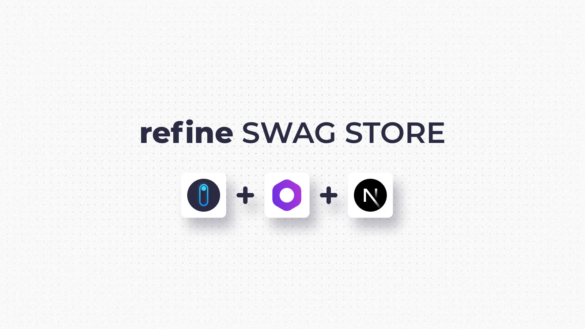

# Refine Swag Store



## Live App Link

Here is the deployed version
https://store.refine.dev/

## About

### Participants

refine.dev - [GitHub](https://github.com/refinedev/refine) - [Twitter](https://twitter.com/refine_dev) - [Discord](https://discord.gg/refine)

### Description

This is a complete eCommerce storefront app built with refine, Medusa.js, Next.js, and Stripe.

We were planning to build a swag store for our open source project called refine.

We had two options when it came to building this shop.

The first option was to deploy a ready-made solution like Shopify, and the second was to create a custom solution.

Since Refine can be used to build eCommerce storefronts with SSR support, we started looking for Headless eCommerce solutions.
During this process, we met with the Medusa, and we decided that the solution offered by Medusajs fit us quite well.
Starting from this, we decided to use the Medusa commerce API and built the storefront app with Refine and Next.js.

In that way, we could share complete eCommerce store solutions with the open source community. Also, it helps us to test our framework with a real-world use case.

We deployed our Medusa commerce API fastly without pain. First, we deployed our admin interface and created products, collections, and other stuff.
For the UI, we used [Vercel's eCommerce template](https://demo.vercel.store/). Since there is no payment step involved in Vercel's eCommerce template, we took advantage of the (nextjs-starter-medusa)[https://github.com/medusajs/nextjs-starter-medusa] for checkout and account features.

So basically, we built a complete eCommerce storefront by combining Vercel's eCommerce template with nextjs-starter-medusa.

Currently, we are using this store and have already processed real shopping transactions with credit cards and gift codes.

The app includes the following features:

- Authentication & Authorization
- Product Listing
- Account information pages
- Product detail
- Shopping cart
- Payment with Stripe
- Gift Code feature
- Email send and verification

### Preview


## Set up Project

### Prerequisites

- Minimum Node v16.0.0
- [Stripe Account](https://stripe.com/)
- [Medusa API](https://docs.medusajs.com/quickstart/quick-start)

### Install Project

Create the project

```
npm create refine-app@latest -- --example store
```

Go to the project directory.

```bash
npm run dev
```

## Resources

- [Refine Documentation](https://refine.dev/docs/getting-started/overview/)
- [Medusa Documentation](https://docs.medusajs.com/quickstart/quick-start)
- [Data provider](https://refine.dev/docs/api-reference/core/providers/data-provider/)
  - [@refinedev/medusa](https://www.npmjs.com/package/@refinedev/medusa)
- [Auth Provider](https://refine.dev/docs/api-reference/core/providers/auth-provider/)
  - [@refinedev/medusa](https://www.npmjs.com/package/@refinedev/medusa)
